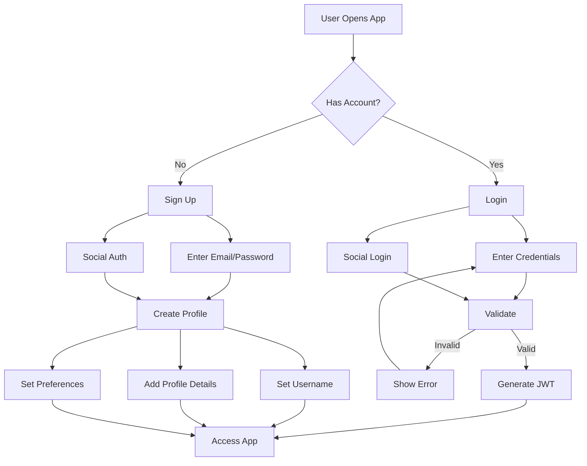
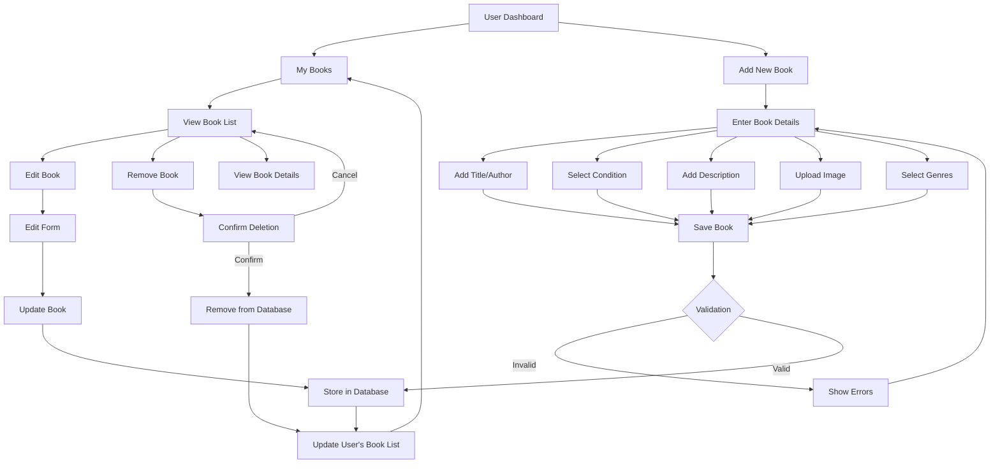
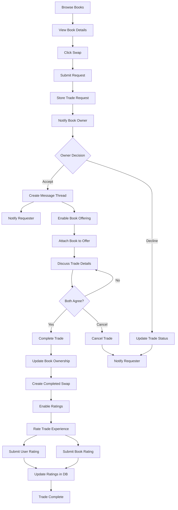
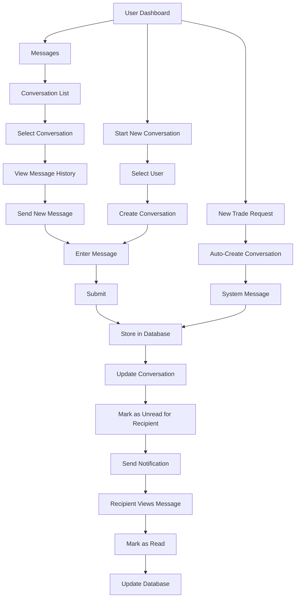
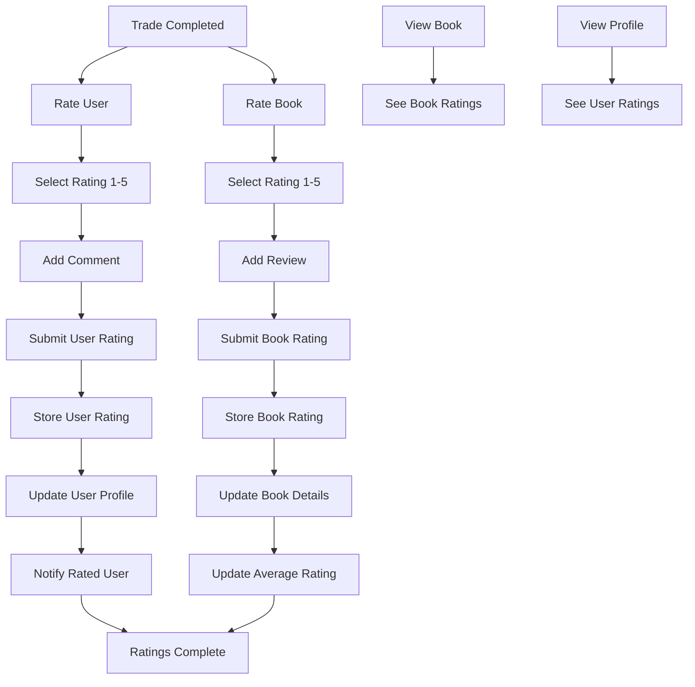
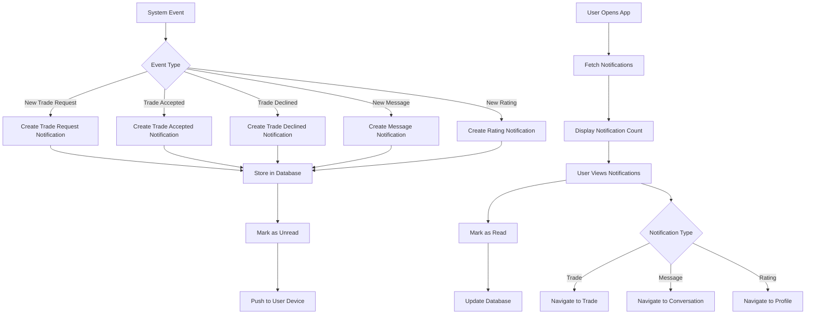
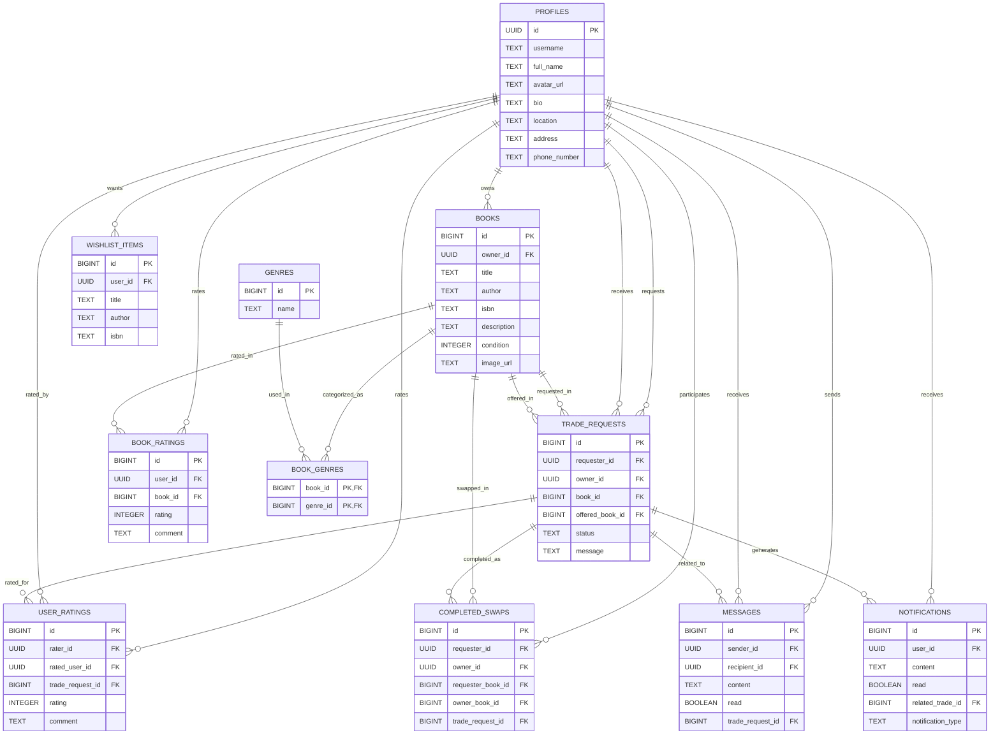

# BookTrade Application Flows

This document outlines the key user flows and processes in the BookTrade application. These flow diagrams provide a visual reference to help streamline development and ensure consistent implementation of core features.

## Table of Contents

1. [User Authentication Flow](#user-authentication-flow)
2. [Book Management Flow](#book-management-flow)
3. [Book Trade Process](#book-trade-process)
4. [Messaging System Flow](#messaging-system-flow)
5. [Rating and Review Flow](#rating-and-review-flow)
6. [Notification System Flow](#notification-system-flow)
7. [Data Relationships Diagram](#data-relationships-diagram)

## User Authentication Flow

## Book Management Flow

## Book Trade Process

## Messaging System Flow

## Rating and Review Flow

## Notification System Flow

## Data Relationships Diagram

## Development Sequence Recommendation

For efficient development, consider implementing features in this order:

1. **Authentication & User Profiles**
   - Basic login/registration
   - Profile creation and management

2. **Book Management**
   - Book listing and details
   - Genre categorization

3. **Book Discovery**
   - Search and browse functionality
   - Filtering options

4. **Trade System**
   - Trade request creation
   - Trade acceptance/rejection
   - Completed swap recording

5. **Messaging System**
   - Direct messaging
   - Trade-related communication

6. **Rating System**
   - User ratings
   - Book ratings

7. **Notification System**
   - Trade notifications
   - Message alerts
   - System announcements

This sequence allows for incremental testing and ensures that core functionality is in place before building dependent features. 